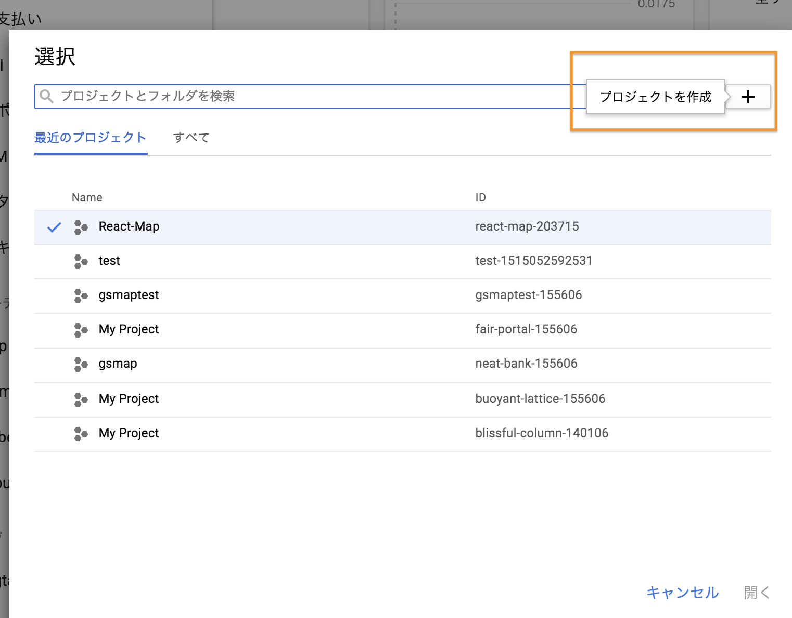

## Googlemap React
### イントロダクション
- `create-react-app`でファイル作成
- `npm install --save react-google-maps`
- `npm install --save materialize-css`

### Higher-OrderComponentsについて
- `https://reactjs.org/docs/higher-order-components.html`

### GoogleMapコンポーネント
- src/components/Map.js
```js
import React, { Component } from 'react'
// 1 import
import { GoogleMap, Marker, WithGoogleMap, withGoogleMap } from 'react-google-maps'


const google = window.google;

class Map extends Component{
  constructor(){
    super();
  }
  render(){
    //2
    const MyMapComponent = withGoogleMap((props) => 
      <GoogleMap
      defaultZoom={14}
        position={{ lat: 19.39029, lng: -99.2838898 }}
      defaulttitle="Mapa"
      >

      </GoogleMap>
    );
    return(
      //3
      <MyMapComponent
        loadingElement={<div style={{ height: '100%' }} />}
        containerElement={<div style={{ height: '70vh' }} />}
        mapElement={<div style={{ height: '100%' }} />}
        />
    );
  }
}

export default Map;
```
- App.jsを修正
```js
import React, { Component } from 'react';
import './App.css';
import 'materialize-css/dist/css/materialize.min.css';
import MyMap from './components/Map'

class App extends Component {
  render() {
    return (
      <div className="App">
      //MyMapをインポートする
        <div className="card">
          <div className="card-content">
            <MyMap ref="map"/>
          </div>
        </div>
      </div>
    );
  }
}

export default App;
```

## GoogleMapのAPIの設定
- ダッシュボードから＋マークのアイコンを押してプロジェクト名を記入、そして作成
v
- 左側のサイドナビの「APIとサービス」をクリック、ダッシュボード
- ライブラリを選んで、今回は[https://console.cloud.google.com/apis/library/maps-backend.googleapis.com/?filter=category:maps&id=fd73ab50-9916-4cde-a0f6-dc8be0a0d425&project=react-map-203715&folder&organizationId]を利用
